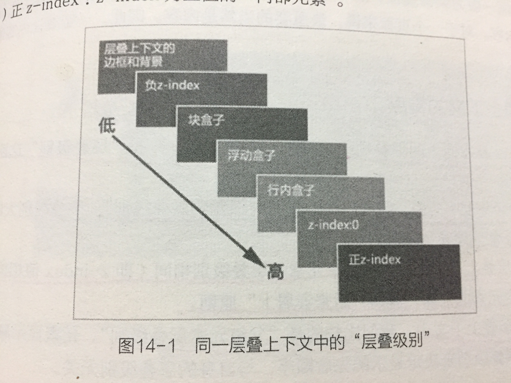

### border的小技巧  
1. 浏览器解析border: none 并不会作出渲染。而border: 0 虽然在页面上看不见，但是浏览器依然会对border进行渲染，占用内存。  
### padding/margin设置为百分比其值是基于父元素的宽度值计算的  
### 外边距叠加的三种情况
1. 同级元素。上下两个同级元素之间，上面元素的下边距与下面元素的上边距会发生叠加。
2. 父子元素。在没有padding或border分隔开的情况下，父元素和子元素的相邻上下外边距也会发生合并。
3. 空元素。指的是没有子元素或者没有文字内容的元素，例如 ，
。当一个元素有上下外边距时，如果没有border或者padding，
则元素的上外边距和下外边距会发生合并。如果空元素的外边距碰到另一个元素的外边距，它们也会发生合并。  

**需要注意的几点**
- 外边距叠加之后的外边距高度等于发生叠加之前的两个外边距中的最大值
- 外边距叠加针对的是block以及inline-block块元素，不包括inline元素。因为inline元素的margin-top和margin-bottom设置无效  

### 负margin  
1. 当元素的margin-top或者margin-left为负数时，“当前元素”会被拉向指定方向  
2. 当元素的margin-bottom或者margin-right为负数时，“后续元素”会被拉向指定方向  

### display: table-cell应用     
1. 图片垂直居中于元素
2. 等高布局。父元素设置：display: table-row，子元素设置：display: table-cell
3. 自动平均划分元素。父元素设置：display: table,子元素设置：display: table-cell  

### 去除inline-block元素间距  
在父元素上设置：font-size: 0  
### text-indent: -9999px 隐藏网站logo的文字部分，利于SEO  
### line-height取值  
1. 行高，指的是“两行基线之间的垂直距离”
2. 行距，指的是上一行的底线到下一行的顶线的垂直距离。也就是两行文字之间的空隙。
2. 一行文字的高度是由line-height决定，而不是由height决定的。  
3. 当line-height值为百分比值、em值时，当前元素的行高是相对于父元素的font-size值来计算的：  
line-height = (父元素 font-size) * 百分比  
line-height = (父元素 font-size) * em值  
4. 当line-height值为无单位数字时，实际的行高相当于当前元素的font-size值来计算  
### vertical-align  
1. vertical-align属性用于定义“周围的文字、inline元素以及inline-block元素”相对于该元素基线的垂直对齐方式。这里的“该元素”指的是被定义了vertical-align属性的元素  
2. 在表格单元格中，vertical-align属性可以定义单元格td元素中内容的对齐方式。  
3. vertical-align属性对inline元素、inline-block元素和table-cell元素有效。对块元素无效。  
4. vertical-align属性允许指定负长度值（如-2px，表示元素相对于基线向下偏移2px，此方法常常用于解决单选框或复选框与文字垂直对齐的问题）和百分比值（如50%，这个百分比是相对于当前元素所继承的line-height属性值决定的）  

### 正常文档流  
将一个页面从上到下分为一行一行，其中块元素独占一行，相邻行内元素在每一行中按照从左到右排列直到该行排满。

### 浮动  
1. 浮动的副作用
	1.1 父元素高度塌陷，从而导致边框不能撑开，背景色无法显示  
	1.2 页面布局错乱  
2. 浮动对元素的影响
	2.1 对自身的影响：如果一个元素设置了浮动，则不管这个元素是什么类型，都会转化为块元素，也就是display属性值为block  
	2.2 对父元素影响：如果一个元素设置了浮动，它会脱离正常文档流。如果浮动元素的高度height大于父元素的高度height，或者父元素没有定义高度height，此时浮动元素会脱离父元素。  
	2.3 对兄弟元素的影响
		2.3.1 兄弟元素是浮动元素
			- 同一方向的兄弟元素，这些元素会从左到右，从上到下，一个接着一个紧挨着排列  
			- 相反方向的兄弟元素，这两个元素会移向两边  
		2.3.2 兄弟元素不是浮动元素  
			浮动的元素可能会覆盖兄弟元素
	2.4 对子元素的影响  
	如果一个元素是浮动元素，并且它的子元素也是浮动元素，则这个浮动元素会自适应地包含该子元素。

### z-index属性与层叠上下文  
1. z-index属性
  z-index属性设置元素的堆叠顺序，拥有更高堆叠顺序的元素总是会处于堆叠顺序较低的元素的前面。该属性设置一个定位元素沿z轴的位置，z轴定义为垂直延伸到显示区的轴。如果为正数，则离用户更近，
为负数，则表示离用户更远。默认情况下，元素的z-index属性处于不激活状态。z-index属性只有在元素定义"position: relative"，"position: absolute 或者 position: fixed"时才会被激活。
当然，对于"position: fixed"的z-index也没什么值得去管，直接忽略即可。如果z-index值相同，则遵循"后来者居上"规则来叠加。

2. 层叠上下文
层叠上下文，是HTML中的一个三维概念。    

2.1. 创建一个新的层叠上下文
	- 根元素
	- z-index不为auto的定位元素    

3.层叠级别  
  
层叠级别是针对同一个层叠上下文而言的。  
在同一个层叠上下文中，层叠级别从低到高排列。    

	  
	
	

	3.1.背景和边框（父级）：也就是当前层叠上下文的背景和边框。
	3.2.负z-index：z-index为负值的"内部元素"
	3.3.块盒子：普通文档流下的块盒子（block-level box）
	3.4.浮动盒子：非定位的浮动元素（也就是排除了 position: relative 的浮动盒子）
	3.5.行内盒子：普通文档流下的行内盒子（inline-level box）
	3.6.z-index: 0: z-index为0的"内部元素"
	3.7.正z-index: z-index为正值的"内部元素"

4.层叠上下文的特点  
  一个元素在z轴方向上的堆叠顺序，是由"层叠上下文" 和 "层叠级别" 这两个因素决定的。    
  
	4.1. 同一个层叠上下文中，我们比较的是"内部元素层叠级别"。层叠级别大的元素显示
	在上，层叠级别小的元素显示在下。
	4.2. 同一个层叠上下文中，如果两个元素的层叠级别相同（即z-index值相同），这后面的元素堆叠在
	前面元素的上面，遵循"后来者居上"原则。
	4.3. 不同的层叠上下文中，我们比较的是"父级元素层叠级别"。元素显示顺序以"父级层叠上下文"的层叠
	级别来决定显示的向后顺序，与自身的层叠级别无关。    
	
### BFC  
1. 格式上下文    
  格式上下文是css2.1规范中的一个重要概念。它指的是页面中的一块渲染区域，并且这个格式上下文有一套自己
  的渲染规则。格式上下文决定了其内部元素将如何定位，以及和其他元素之间的关系。  
  
  
2. BFC  
	BFC，全称Block Formatting Context（块级格式上下文）。它是一个独立的渲染区域，只有块盒子参与。
	块级格式上下文规定了内部的块盒子是如何布局的，并且这个渲染区域与外部区域毫不相关。    
	
	
	2.1. 创建BFC  
	W3C标准中对BFC的定义：浮动元素，绝对定位元素（position为absolute或fixed）,元素类型（即display属性）为
	inline-block、table-caption、table-cell、以及overflow属性不为visible的元素将会创建一个新的块级格式上
	下文。    
	
	如果一个元素具备以下任何一个条件，则该元素会创建一个新的BFC：    
	
	1. 根元素
	2. float属性除了none以外的值，也就是"float: left"和"float: right"
	3. position属性除了static和relative以外的值，也就是"position: absolute"和"position: fixed"  
	4. overflow属性除了visible以外的值，也就是"overflow: auto" "overflow: hidden"和"overflow: scroll"
	5. 元素类型（即display属性）为inline-block、table-caption、table-cell、flex、inline-flex    

	
	元素类型（即display属性）为block、table、list-item的元素，会生成块盒子，然后块盒子会参与BFC（而不是创建BFC）    
	
	
	2.2. BFC的特点    
	
	
	- 在一个BFC内部，盒子会在垂直方向上一个接着一个地排列。
	- 在一个BFC内部，相邻的margin-top和margin-bottom会叠加（这里的相邻不是指"相邻的兄弟元素"，而是指相邻的margin-top和margin-bottom）。    
	- 在一个BFC内部，每一个元素的左外边界(margin-left)会紧贴着包含盒子的左边(border-left)，即使存在浮动也是如此。
	- 在一个BFC内部，如果存在内部元素是一个新的BFC，并且存在内部元素是浮动元素。则该BFC的区域不会与float元素的区域重叠(position为absolute的元素还是会覆盖float元素的；如果这个元素是overflow:hidden，则float元素不会覆盖)。
	- BFC就是页面上的一个隔离的盒子，该盒子内部的子元素不会影响到外面的元素。
	- 计算一个BFC的高度时，其内部浮动元素的高度也会参与计算(可以知道，如果一个元素是一个BFC，则计算该元素高度的时候，内部浮动子元素的高度也得算进去；也就是说，如果一个元素是BFC，其浮动子元素也会撑开这个元素，因此这个元素的高度等于浮动子元素的高度)。  
	
	2.3. BFC的用途  
	- [创建BFC来避免垂直外边距叠加](./BFC的用途.html)
	  - 
	- 创建BFC来清除浮动
	- 创建BFC来实现自适应布局
	
	
	

